# Robotics Lab 3D Printing Designs

This respository serves as a tracking of STL files, for designs created and used within the lab.
| Name             | Description                          | Image                           | Download File               | More info |
|------------------|--------------------------------------|---------------------------------|-----------------------------| --------------|
| Botzo Robot Dog  | STL files for Botzo our Robot Dog | 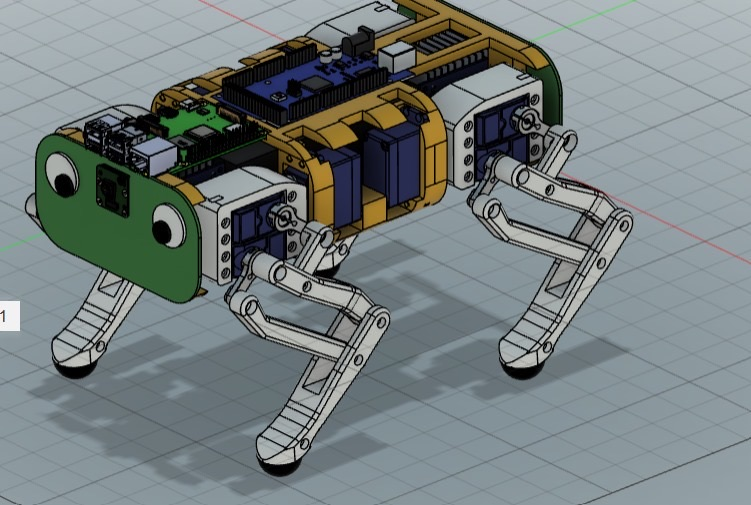          |      | [link to repo](https://github.com/botzo-team/STL_files) |
| Universal Marker     | STL file for creating arbitrary rigid bodies | 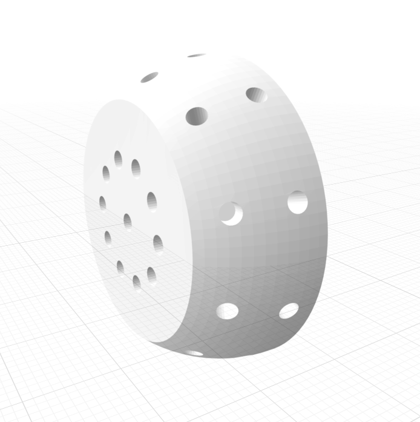          | [Download](files/optitrack/Universal_Marker_3.stl)     |  |
| WX-250 Base | STL file for base of WX-250 robot arm | 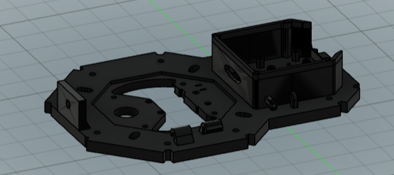 | [Download](files/WX-250_robot_garden/base/bottom_base_WX-250.stl) | [link to repo](https://github.com/IE-Robotics-Lab/WX250_support_structure) |
| WX-250 Base for Optitrak | STL file for base of WX-250 robot arm tuend with M3 scrues for Optitrack detection |  | [Download](https://github.com/IERoboticsAILab/3d_printing_designs/blob/main/files/WX-250_robot_garden/base/bottom_base_WX-250_for%20Optitrack.stl) | [link to repo](https://github.com/IERoboticsAILab/clever_lamp) |
|  WX-250 Base Support | STL file for bigger base support for Base_WX-250 | 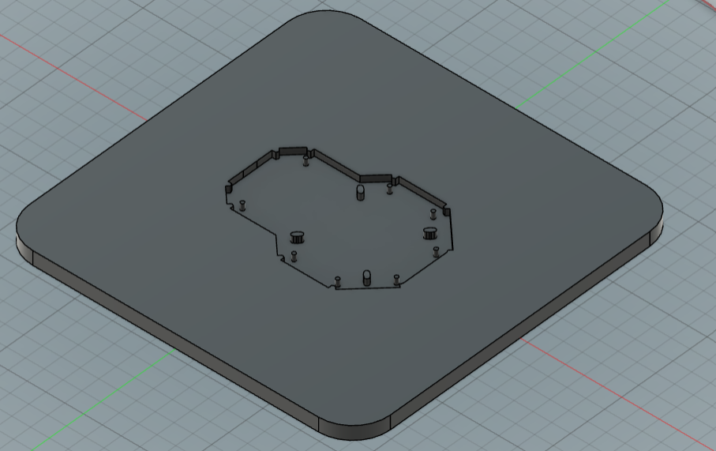 | [Download](files/WX-250_robot_garden/base/bottom_base_larger_support_WX-250.stl) |  |
| WX-250 Electronic Lid | STL file for lid for base of WX-250 robot arm | 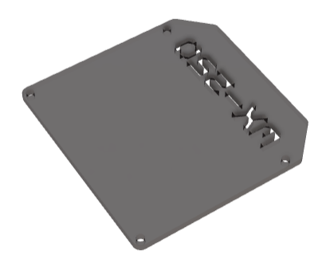 | [Download](files/WX-250_robot_garden/base/lid_electronics_WX-250.stl) | [link to repo](https://github.com/IE-Robotics-Lab/WX250_support_structure) |
| WX-250 Short Rest position | STL file for short tree for rest position WX-250 robot arm | 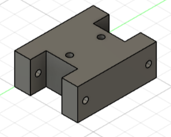 | [Download](files/WX-250_robot_garden/rest_pos_supports/short_stick_tree.stl) | [link to repo](https://github.com/IE-Robotics-Lab/WX250_support_structure) |
| WX-250 Long Rest position | STL file for long tree for rest position WX-250 robot arm | 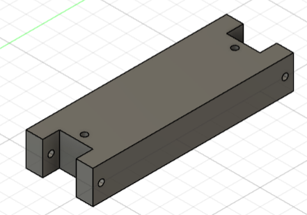 | [Download](files/WX-250_robot_garden/rest_pos_supports/long_stick_tree.stl) | [link to repo](https://github.com/IE-Robotics-Lab/WX250_support_structure) |
| WX-250 70° tree Rest position | STL file for 70° curve tree for rest position WX-250 robot arm | 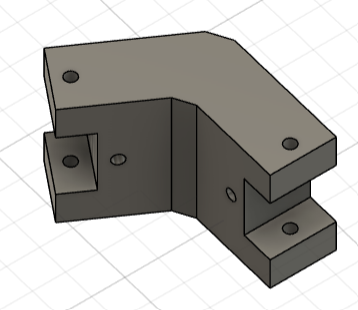 | [Download](files/WX-250_robot_garden/rest_pos_supports/deg70stick_tree.stl) | [link to repo](https://github.com/IE-Robotics-Lab/WX250_support_structure) |
| WX-250 90° tree Rest position | STL file for 90° curve tree for rest position WX-250 robot arm | 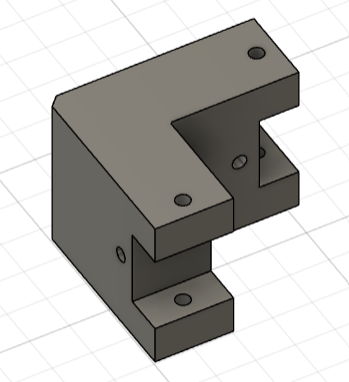 | [Download](files/WX-250_robot_garden/rest_pos_supports/deg90stick_tree.stl) | [link to repo](https://github.com/IE-Robotics-Lab/WX250_support_structure) |
| DMP A6 <-> tross | STL file peace that attch from tross to case. Used as support DMP A6 case | 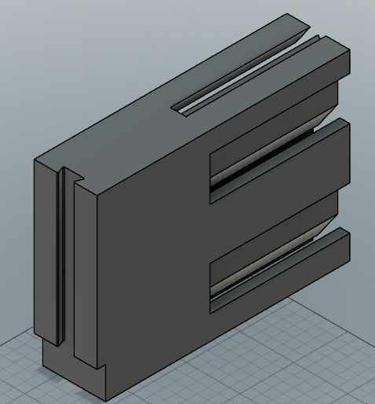 | [Download](files/truss_supports/tross_support_speaker.stl) | |
| DMP A6 left half case | STL file left half of support case for DMP A6 | 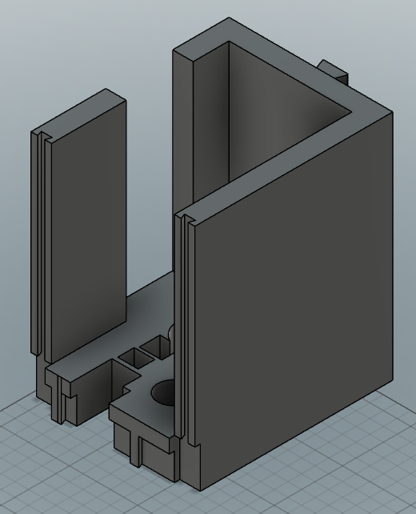 | [Download](files/truss_supports/tross_case_left_speaker.stl) | |
| DMP A6 right half case | STL file right half of support case for DMP A6  | 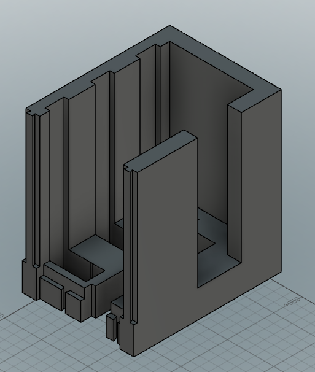 | [Download](files/truss_supports/tross_case_right_speaker.stl) | |
| Case connectors | STL file for connectors to increase overall case strenght  | 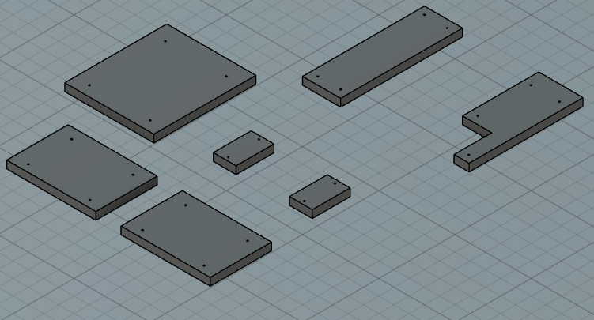 | [Download](files/truss_supports/tross_speacker_connections.stl) | |
| Switch for servo | STL of case for servo motor, to turn on/off DMP A6  | 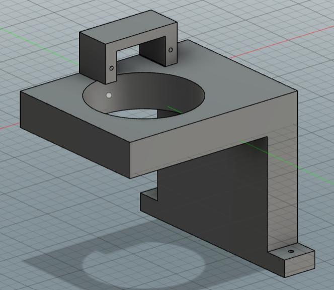 | [Download](files/truss_supports/switch_servo.stl) | [link to repo](https://github.com/IE-Robotics-Lab/servo_switch_DMPA6.git) |
| "Kangaroo" | STL file of design behind creen to keep in place laptop  | 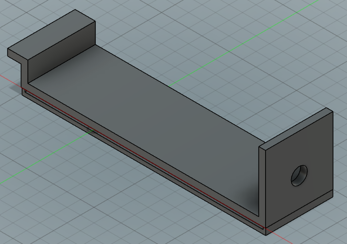 | [Download](files/kangaroo/LaptopSupporter.stl) | |
| clever lamp: wx250s <-> projector mini | STL file of design to attach projector to end-effector of robot arm  | 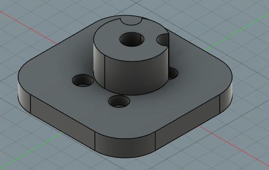 | [Download](files/WX-250_robot_garden/support_projector_wx250s.stl) | [link to repo](https://github.com/IE-Robotics-Lab/clever_lamp.git) |
| clamp for truss to hold power supply box | STL file of design to attach powersupply box to the truss  |  | [Download](https://github.com/IERoboticsAILab/3d_printing_designs/blob/main/files/truss_supports/clamp_power_supply.stl) |  |
| clamp to shelf holder | STL file of design to be a clamp on shelf to hold cables for voltimeter or powersuply  |  | [Download](https://github.com/IERoboticsAILab/3d_printing_designs/blob/main/files/hardware_lab/clamptoshelf_cables_holder_voltimeter.stl) |  |
| spool for cables | STL file of design spool for holdding cables of voltimeter or powersuply  |  | [Download](https://github.com/IERoboticsAILab/3d_printing_designs/blob/main/files/hardware_lab/spool_cables_holder_voltimeter.stl) |  |
| support fix tool | STL file to keep clam hard and fixed on the shelf  |  | [Download](https://github.com/IERoboticsAILab/3d_printing_designs/blob/main/files/hardware_lab/support_fix_tool.stl) |  |
| clap truss support HDMIcalble | clamp for truss to hold spool for long HDMI cable easy usage  |  | [Download](https://github.com/IERoboticsAILab/3d_printing_designs/blob/main/files/truss_supports/clap_truss_support_HDMIcalble.stl) |  |
| LED Stip holder | clamp for truss to hold led lights stirip  |  | [Download](https://github.com/IERoboticsAILab/3d_printing_designs/blob/main/files/hardware_lab/LED%20Strip%20HolderV2.stl) |  |
| truss holder | clamp for truss to hold led lights stirip  |  | [Download](https://github.com/IERoboticsAILab/3d_printing_designs/blob/main/files/hardware_lab/truss%20Holder_v2.stl) |  |
| wire holder wall | attachment for wall to hang wires for powersupplies |  | [Download](https://github.com/IERoboticsAILab/3d_printing_designs/blob/main/files/hardware_lab/wire%20holder%20wall%20v2.stl) |  |